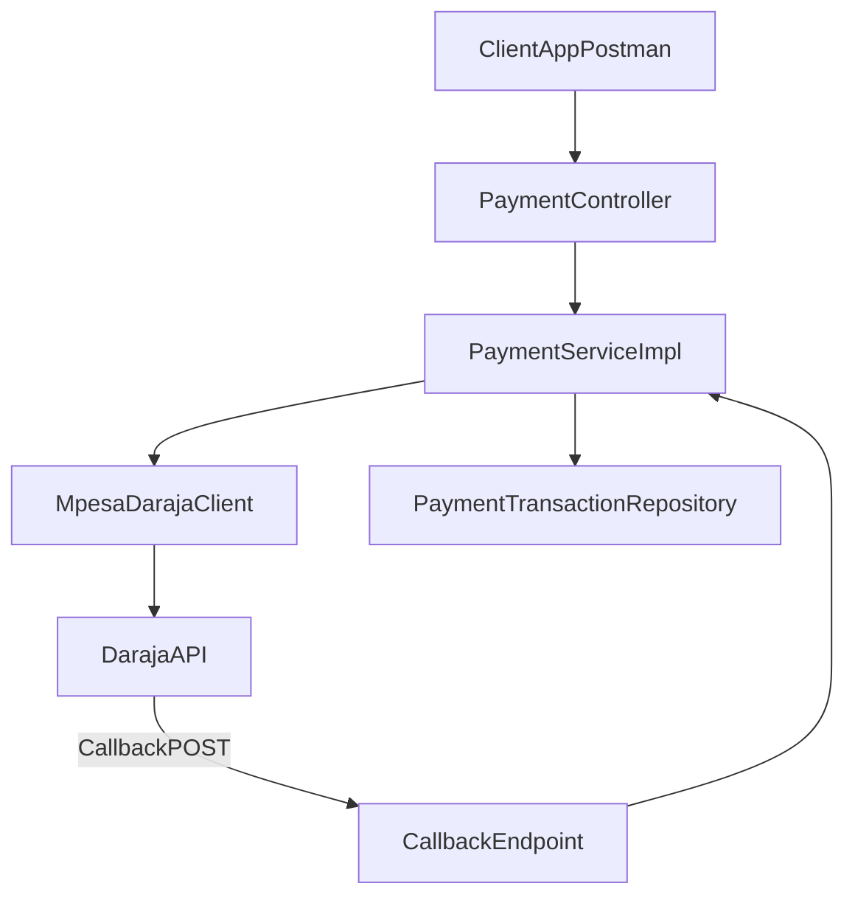
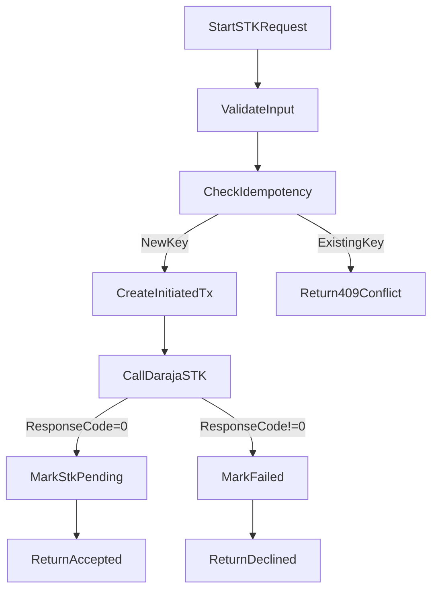
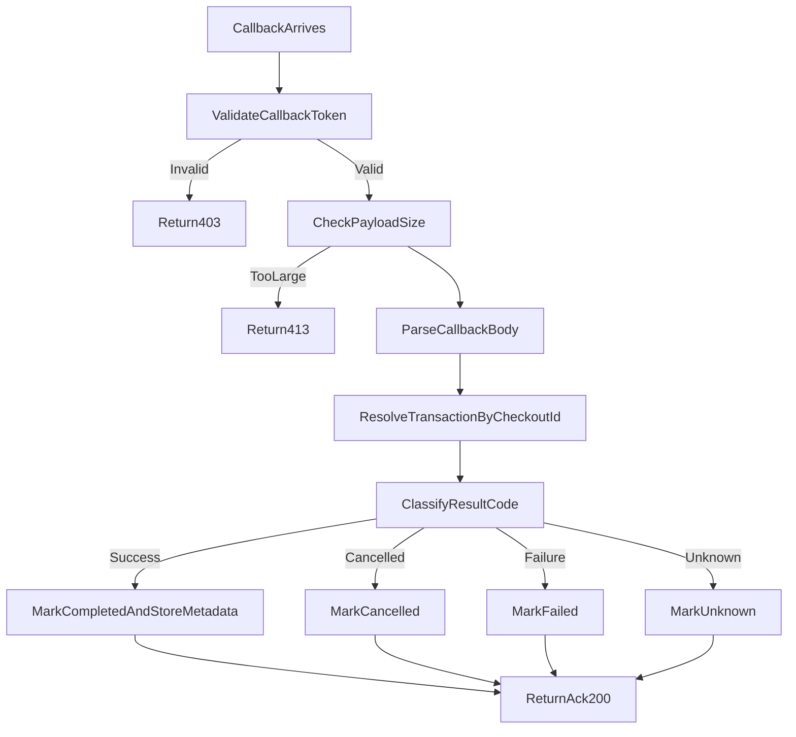
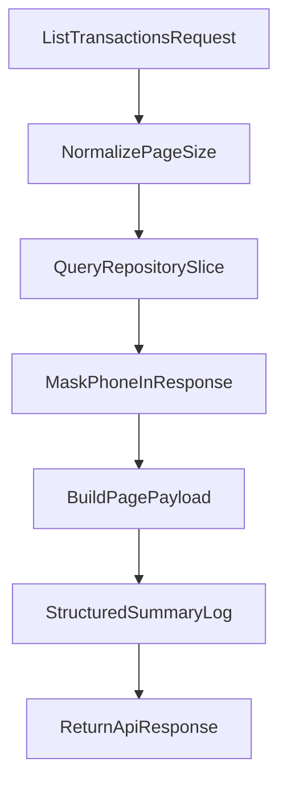

# Visuals Pack for Video

## 1) System Architecture Diagram

## 2) STK Push Lifecycle Diagram

## 3) Callback Lifecycle Diagram

## 4) Transactions List Query Path

## 5) On-Screen Masking Checklist
- Hide values for `MPESA_CONSUMER_KEY`, `MPESA_CONSUMER_SECRET`, `MPESA_PASSKEY`.
- Hide callback token in URL path where possible.
- Mask full phone numbers in screenshots (`2547****678` style).
- Blur any ngrok domains if they are still active.
- Blur `requestId`/internal identifiers if they map to production logs.

## 6) Lower-Third Captions (Optional)
- "Idempotency prevents duplicate charge attempts"
- "Callback token hardens inbound webhook endpoint"
- "Slice pagination improves read performance at scale"
- "Structured logs enable faster operational debugging"
